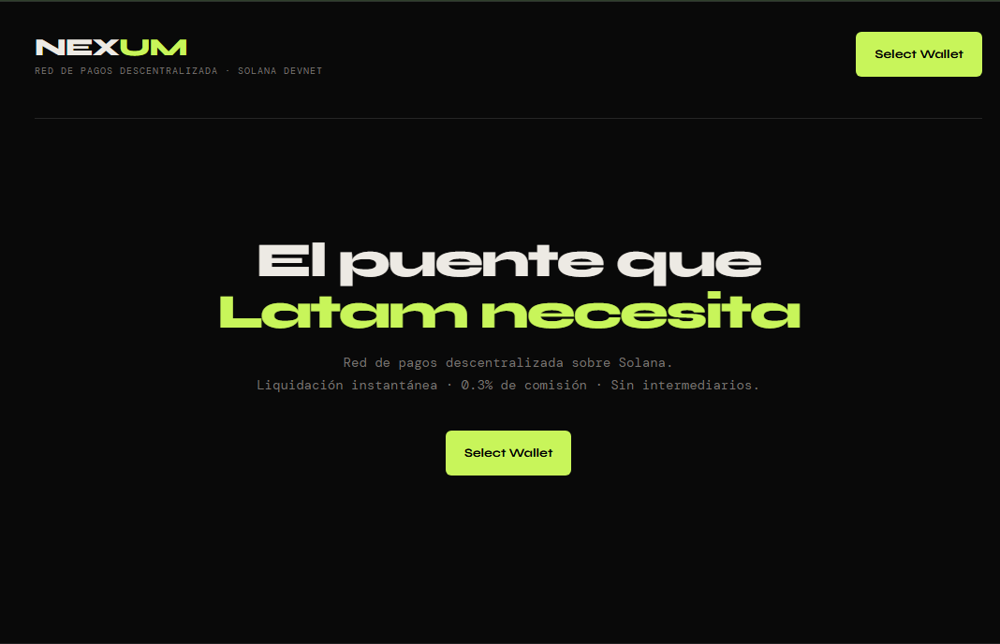
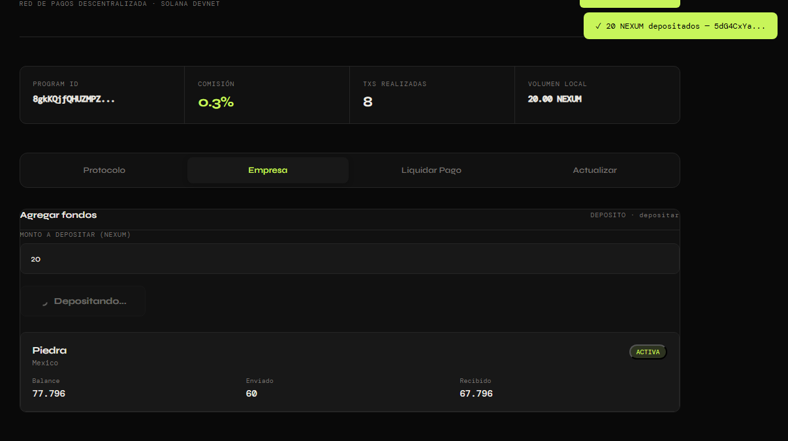
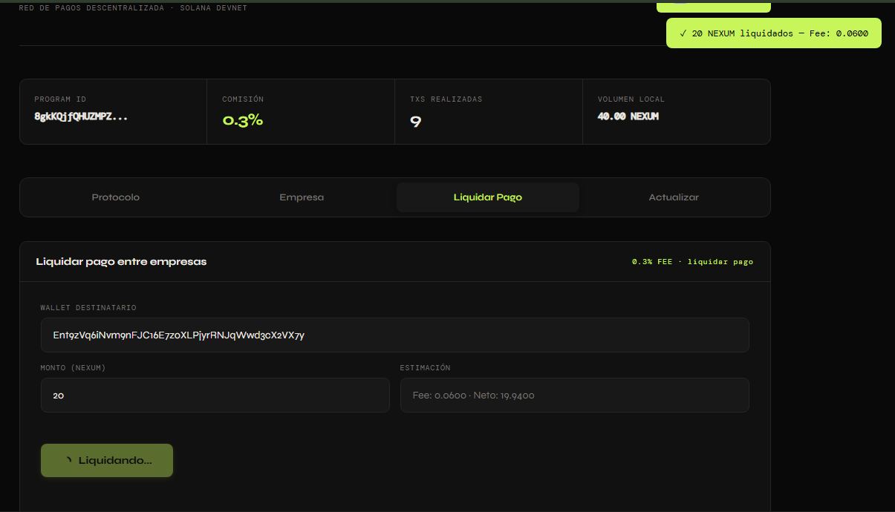

# Nexum Frontend Documentation


## Vista del producto

### Hero



### Flujo de empresa y liquidación



)

## Descripción General

Frontend de Nexum, una red de pagos descentralizada construida sobre Solana Devnet. La aplicación permite a empresas registrarse, depositar fondos y realizar pagos entre ellas con una comisión del 0.3%.

## Stack Tecnológico

| Tecnología | Versión | Propósito |
|------------|---------|-----------|
| React | 19.2.4 | UI Framework |
| TypeScript | ~6.0.2 | Tipado estático |
| Vite | 8.0.4 | Build tool y dev server |
| Solana Web3.js | ^1.98.4 | Interacción con blockchain |
| Solana Wallet Adapter | ^0.15.39 | Conexión con wallets |
| Phantom Wallet | - | Wallet soportada |

## Estructura del Proyecto

```
Nexum/
├── index.html              # Entry point HTML
├── package.json            # Dependencias y scripts
├── vite.config.ts         # Configuración de Vite
├── tsconfig.json          # Config TypeScript principal
├── tsconfig.app.json      # Config TypeScript app
├── tsconfig.node.json     # Config TypeScript Node
├── public/
│   ├── favicon.svg        # Icono de la aplicación
│   └── icons.svg         # Iconos SVG
└── src/
    ├── main.tsx           # Entry point React
    ├── App.tsx            # Componente principal
    └── App.css            # Estilos
```

## Configuración de Vite (`vite.config.ts`)

```typescript
import { defineConfig } from 'vite'
import react from '@vitejs/plugin-react'

export default defineConfig({
  plugins: [react()],
  define: {
    'process.env': {},
    global: 'globalThis',
  },
  resolve: {
    alias: {
      buffer: 'buffer',
      process: 'process/browser',
      events: 'events',
    }
  },
  optimizeDeps: {
    include: ['buffer', 'process', 'events'],
  }
})
```

**Notas:**
- Polyfills para `buffer`, `process` y `events` necesarios para entorno browser
- React plugin para HMR y JSX transform

## Entry Point (`main.tsx`)

```typescript
const endpoint = 'https://api.devnet.solana.com'
const wallets = [new PhantomWalletAdapter()]
```

**Proveedores (Providers hierarchy):**
1. `ConnectionProvider` - Conexión a Solana Devnet
2. `WalletProvider` - Gestión de wallets (Phantom)
3. `WalletModalProvider` - UI para selección de wallet
4. `App` - Componente principal

## Componente Principal (`App.tsx`)

### Estado de la Aplicación

```typescript
// Wallet y conexión
const { publicKey, signTransaction } = useWallet()
const { connection } = useConnection()

// Formularios
const [fInit, setFInit] = useState({ nombre: "" })           // Inicializar protocolo
const [fEmp, setFEmp] = useState({ nombre: "", pais: "" })   // Registro empresa
const [fDep, setFDep] = useState({ monto: "" })              // Depósitos
const [fPago, setFPago] = useState({ dest: "", monto: "" })  // Pagos
const [fUpd, setFUpd] = useState({ nombre: "", pais: "" })   // Actualizaciones

// Estado de la empresa
const [empresa, setEmpresa] = useState<EmpresaLocal | null>(null)
const [protocoloExiste, setProtocoloExiste] = useState(false)
const [protocoloData, setProtocoloData] = useState<{ totalTxs: number } | null>(null)

// Transacciones y UI
const [txs, setTxs] = useState<TxLocal[]>([])
const [txCount, setTxCount] = useState(0)
const [tab, setTab] = useState<"init" | "empresa" | "pagar" | "update">("init")
const [notif, setNotif] = useState<Notif | null>(null)

// Loading states
const [loadingInit, setLoadingInit] = useState(false)
const [loadingEmp, setLoadingEmp] = useState(false)
const [loadingDep, setLoadingDep] = useState(false)
const [loadingPago, setLoadingPago] = useState(false)
const [loadingUpdate, setLoadingUpdate] = useState(false)
```

### Interfaces Principales

```typescript
interface EmpresaLocal {
  nombre: string
  pais: string
  balance: number        // en NEXUM
  totalEnviado: number   // en NEXUM
  totalRecibido: number  // en NEXUM
  activa: boolean
}

interface TxLocal {
  sig: string           // firma de transacción
  monto: number
  fee: number           // 0.3% del monto
  montoNeto: number
  timestamp: string
  destino: string       // wallet destino (truncada)
}

interface Notif {
  tipo: "exito" | "error" | "info"
  mensaje: string
}
```

### Programa de Solana

```typescript
const PROGRAM_ID = new PublicKey("8gkKQjfQHUZMPZqGMdRuuQoiSxmSqMnuG248LE8mcN2Q")

const PROTOCOLO_PDA = PublicKey.findProgramAddressSync(
  [Buffer.from("protocolo")],
  PROGRAM_ID
)[0]
```

**PDAs (Program Derived Addresses):**
- `PROTOCOLO_PDA`: `["protocolo"]` - Almacena estado global del protocolo
- `getEmpresaPDA(owner)`: `["empresa", owner.toBuffer()]` - Datos de empresa
- `getTxPDA(pagador, nonce)`: `["tx", pagador.toBuffer(), nonce]` - Transacción

### Instrucciones del Programa

```typescript
const DISC = {
  initialize: Buffer.from([175, 175, 109, 31, 13, 152, 155, 237]),
  registerEmpresa: Buffer.from([199, 216, 68, 141, 228, 45, 54, 198]),
  updateEmpresa: Buffer.from([18, 242, 134, 167, 47, 236, 233, 63]),
  deactivateEmpresa: Buffer.from([151, 53, 121, 125, 201, 176, 10, 237]),
  liquidarPago: Buffer.from([107, 53, 210, 189, 236, 89, 228, 207]),
  depositar: Buffer.from([207, 16, 199, 114, 220, 5, 105, 219]),
}
```

### Funciones de Codificación

```typescript
const encStr = (s: string) => {
  const b = Buffer.from(s, "utf8")
  const l = Buffer.alloc(4)
  l.writeUInt32LE(b.length, 0)
  return Buffer.concat([l, b])
}

const encU64 = (n: number) => {
  const b = Buffer.alloc(8)
  b.writeBigUInt64LE(BigInt(Math.floor(n)), 0)
  return b
}

const encOption = (s: string) => {
  if (!s.trim()) return Buffer.from([0])
  return Buffer.concat([Buffer.from([1]), encStr(s)])
}
```

### Función `sendIx` - Envío de Transacciones

Maneja el envío de instrucciones con:
- Reintentos automáticos (3 intentos por defecto)
- Manejo de errores de blockhash
- Verificación de confirmación
- Manejo de transacciones duplicadas

```typescript
const sendIx = async (keys: any[], data: Buffer, retries = 3): Promise<string>
```

**Características:**
- Usa `skipPreflight: false` para validación previa
- Confirmación con nivel `"confirmed"`
- Reintento en errores de blockhash
- Verifica si la TX ya fue procesada antes de fallar

### Funciones Principales

#### `handleInit()` - Inicializar Protocolo
- Crea la cuenta `PROTOCOLO_PDA`
- Requiere: nombre del protocolo
- Verifica si ya existe antes de enviar

#### `handleRegEmp()` - Registrar Empresa
- Crea PDA de empresa asociada a la wallet
- Requiere: nombre y país
- Verifica registro duplicado

#### `handleDeposit()` - Depositar Fondos
- Envía SOL y actualiza balance en la PDA
- Convierte a lamports: `monto * 1_000_000`
- Refresca estado después de 2 segundos

#### `handlePago()` - Liquidar Pago
- Transferencia entre empresas
- Calcula fee automático (0.3%)
- Verifica balance suficiente
- Obtiene `txCount` actualizado de la blockchain
- Crea registro de transacción local

#### `handleUpdate()` - Actualizar Empresa
- Actualiza nombre y/o país (opcional)
- Usa `encOption` para campos opcionales

#### `handleToggleActiva()` - Activar/Desactivar
- Cambia estado activo/inactivo
- Envía `0` o `1` según estado actual

### Estructura de UI

```
App
├── Notificación (toast)
├── Header
│   ├── Logo "NEXUM"
│   ├── Tagline
│   └── WalletMultiButton
└── Content
    ├── Sin wallet: Hero section
    └── Con wallet:
        ├── Stats bar (Program ID, Fee, Txs, Volumen)
        ├── Tabs (Protocolo, Empresa, Liquidar Pago, Actualizar)
        └── Panels según tab activo
            ├── init: Inicializar protocolo
            ├── empresa: Registrar/Depositar/Ver empresa
            ├── pagar: Liquidar pago
            └── update: Actualizar datos
```

## Estilos (`App.css`)

### Tema Dark (CSS Variables)

```css
:root {
  --bg: #090909;
  --surface: #111111;
  --surface2: #181818;
  --border: #252525;
  --text: #EDEAE4;
  --muted: #777370;
  --accent: #C8F55A;      /* Verde lima */
  --accent2: #9DBF3E;
  --danger: #FF4444;
  --syne: 'Syne', sans-serif;
  --mono: 'DM Mono', monospace;
}
```

### Fuentes
- **Syne**: Títulos y UI general (400, 600, 700, 800)
- **DM Mono**: Datos, códigos, métricas (300, 400, 500)

### Componentes Estilados

| Clase | Descripción |
|-------|-------------|
| `.app` | Contenedor principal (max-width: 1060px) |
| `.hdr` | Header con logo y wallet |
| `.stats` | Grid de 4 columnas con métricas |
| `.tabs` | Navegación por pestañas |
| `.tab` | Botón de pestaña individual |
| `.panel` | Contenedor de formularios |
| `.fgrid` | Grid de formulario (2 columnas) |
| `.finput` | Inputs de formulario |
| `.btn` | Botones base |
| `.btn-p` | Botón primario (verde) |
| `.btn-s` | Botón secundario (gris) |
| `.ecard` | Tarjeta de empresa |
| `.tx-list` | Lista de transacciones |
| `.notif` | Toast notifications |

### Responsive
Breakpoint: 720px
- Stats: 4 columnas → 2 columnas
- Form grid: 2 columnas → 1 columna
- Hero title: 52px → 36px

## Scripts Disponibles

```bash
npm run dev          # Servidor desarrollo (Vite)
npm run build        # Build producción
npm run build:check  # TypeScript check + build
npm run lint         # ESLint
npm run preview      # Preview build local
```

## Flujo de Usuario

1. **Conexión**: Usuario conecta wallet Phantom
2. **Inicialización**: Admin inicializa el protocolo (una sola vez)
3. **Registro**: Empresa se registra con nombre y país
4. **Depósito**: Agrega fondos a su balance
5. **Pagos**: Realiza pagos a otras empresas (fee 0.3%)
6. **Actualización**: Modifica datos o activa/desactiva

## Decodificación de Datos On-Chain

### Protocolo
```typescript
function decodeProtocoloData(data: Buffer): { totalTransacciones: bigint; nombre: string }
```
- Discriminator: 8 bytes
- Authority: 32 bytes
- Nombre: 4 bytes length + string
- Fee BPS: 2 bytes + 6 padding
- Total Volume: 8 bytes (u64)
- Total Transacciones: 8 bytes (u64)

### Empresa
- Discriminator: 8 bytes
- Owner: 32 bytes
- Nombre: 4 bytes length + string
- País: 4 bytes length + string
- Balance: 8 bytes (u64, lamports)
- Total Enviado: 8 bytes (u64)
- Total Recibido: 8 bytes (u64)
- Activa: 1 byte

## Notas de Implementación

1. **Buffer polyfill**: Requerido para navegador, configurado en `vite.config.ts`
2. **Lamports**: 1 NEXUM = 1,000,000 lamports
3. **Fee**: 0.3% calculado como `monto * 0.003`
4. **TxCount**: Se obtiene del protocolo PDA para generar PDAs únicas
5. **Refresh delays**: 2 segundos después de depositar/pagar para dar tiempo a la blockchain
6. **Toast notifications**: Auto-dismiss a los 4 segundos

## Dependencias Clave

**Runtime:**
- `@solana/wallet-adapter-react`: Conexión wallets
- `@solana/web3.js`: Web3.js v1 (no v2)
- `buffer`: Polyfill Buffer
- `react`: UI

**Dev:**
- `vite`: Build tool
- `@vitejs/plugin-react`: React integration
- `typescript`: Tipado
- `eslint`: Linting

## Posibles Mejoras
- [ ] Mejorar manejo de errores con mensajes amigables
- [ ] Persistencia local de historial de TX
- [ ] Soporte para múltiples wallets
